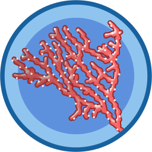

# coral

[](https://travis-ci.org/klavinslab/coral)
[](https://readthedocs.org/projects/coral/?badge=latest)


Coral: Core tools for synthetic DNA design. Read the documentation at http://coral.readthedocs.org.

Coral is a Python library for encoding the process of designing synthetic DNA constructs. Coral mirrors the traditional design steps used in GUI-based sequence design (ApE, j5, Benchling, etc.) as operations on data structures, enables iterative design through analysis modules, and connects seamlessly to outside libraries. Through the use of Coral, you can translate your DNA design processes into concise, executable, and reusable scripts.

Coral encodes synthetic DNA design rules into its core sequence data types (`DNA`, `RNA`, and `Peptide`), enabling concise, dependable methods for automated DNA design.

Coral works with PyPy so long as a PyPy-compatible numpy is installed.

## Installation:

Most users:
```
pip install coral
```

To get the latest on git:

```
git clone https://github.com/klavinslab/coral.git
cd coral
pip install .
```

## Requirements:

###python (pip-compatible):

```
numpy
biopython
```

optional:

| Package | Added functionality |
| --- | --- |
| `matplotlib` | plotting sequencing analysis |
| `intermine`, `requests` | yeast database (intermine) functions |

###system:

| Package | Added functionality |
| --- | --- |
| `NuPack` | Structural analysis |
| `ViennaRNA` | Structural analysis |

## Development:

Install the extra packages in dev-requirements.txt (`Sphinx`, `cython`,
`nose`).

## License

MIT

## Author

Contact Nick at nbolten@gmail.com with any questions about Coral.
