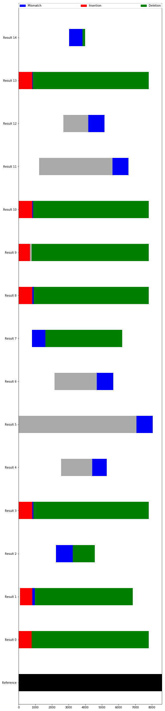

Sequencing
----------

Analyzing sequencing results (Sanger method) is a common cloning task
that can eat up a lot of time without a lot of gain. The basic principle
is that you receive the sequence for a short region of a template
(usually a plasmid or PCR fragment) and need to compare it to your
expected sequence to see if any errors were made (usualy
mismatches/indels) or if you have confirmed a large enough part of your
sequence (coverage). We'll go over how coral makes this straightforward
and fast with a short example.

First, we'll need to analyze our sequencing using the Sanger class
(``analysis`` module) and read in sequences (``seqio`` module).

.. code:: ipython2

    import coral as cor

Then use seqio to read in our sequences. The Sanger class expects two
inputs: a reference, or expected, sequence (``sequence.DNA`` object) and
a list of the results (``list`` of ``sequence.DNA`` objects). Any way
that you want to generate those objects is fine, but a simple way is to
store them both in a single directory and then read them in.

As a reference sequence, I have a genbank file (actually an ApE file -
but it's basically genbank) that includes the complete plasmid I
sequenced annotated with a bunch of features. For this, use
``seqio.read_dna``, which expects a path to the file (.ape, .gb, .fa,
.fasta, .seq, .abi, and .ab1 are all acceptable formats).

In the same folder there are 15 results which should cover the entire
plasmid and show that the sequence is accurate. For this, we use
``seqio.read_sequencing``, which accepts a path to a folder and reads in
all sequencing (.seq, .ab1, .abi) files and stores them as a list of DNA
objects.

.. code:: ipython2

    reference = cor.seqio.read_dna('../files_for_tutorial/maps/pMODKan-HO-pACT1GEV.ape')
    results = cor.seqio.read_sequencing('../files_for_tutorial/sequencing_files/')

To compare the results to our expected sequence, we use the ``Sanger``
class, which does a Needleman-Wunsch alignment and scores any
discrepancies.

.. code:: ipython2

    alignment = cor.analysis.Sanger(reference, results)

The Sanger alignment object contains our aligned sequences and some
methods for analyzing them.

Chiefly, it's useful to look at where predicted mismatches or indels are
predicted, as they may disagree with the consensus.

.. code:: ipython2

    alignment.plot()

The plot is a bit ugly right now, but very functional. The deletions are
all right at the beginning or end of our results and so probably aren't
really there. In addition, there is another sequencing result showing no
deletions at every one of those locations - we can reasonably assume
those deletions are not actually there. If we were worried, however, we
could investigate the ab1 files directly in another program.

