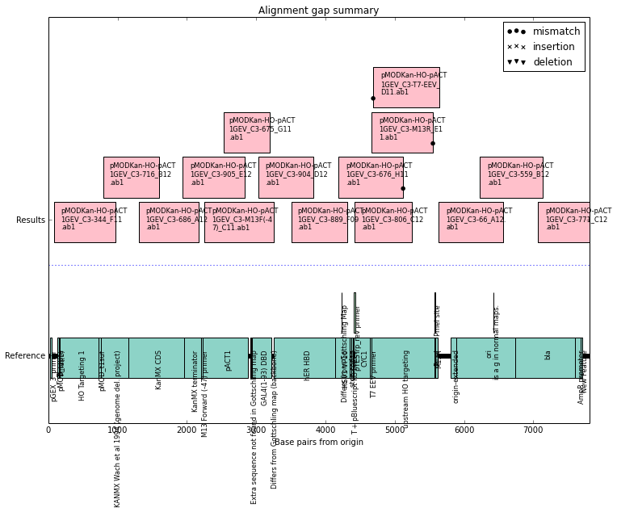

Sequencing
----------

Analyzing sequencing results (Sanger method) is a common cloning task
that can eat up a lot of time without a lot of gain. The basic principle
is that you receive the sequence for a short region of a template
(usually a plasmid or PCR fragment) and need to compare it to your
expected sequence to see if any errors were made (usualy
mismatches/indels) or if you have confirmed a large enough part of your
sequence (coverage). We'll go over how pymbt makes this straightforward
and fast with a short example.

First, we'll need to analyze our sequencing using the Sanger class
(``analysis`` module) and read in sequences (``seqio`` module).

.. code:: python

    import pymbt as pbt
Then use seqio to read in our sequences. The Sanger class expects two
inputs: a reference, or expected, sequence (``sequence.DNA`` object) and
a list of the results (``list`` of ``sequence.DNA`` objects). Any way
that you want to generate those objects is fine, but a simple way is to
store them both in a single directory and then read them in.

As a reference sequence, I have a genbank file (actually an ApE file -
but it's basically genbank) that includes the complete plasmid I
sequenced annotated with a bunch of features. For this, use
``seqio.read_dna``, which expects a path to the file (.ape, .gb, .fa,
.fasta, .seq, .abi, and .ab1 are all acceptable formats).

In the same folder there are 15 results which should cover the entire
plasmid and show that the sequence is accurate. For this, we use
``seqio.read_sequencing``, which accepts a path to a folder and reads in
all sequencing (.seq, .ab1, .abi) files and stores them as a list of DNA
objects.

.. code:: python

    reference = pbt.seqio.read_dna('../files_for_tutorial/maps/pMODKan-HO-pACT1GEV.ape')
    results = pbt.seqio.read_sequencing('../files_for_tutorial/sequencing_files/')
To compare the results to our expected sequence, we use the ``Sanger``
class, which does a Needleman-Wunsch alignment and scores any
discrepancies.

.. code:: python

    alignment = pbt.analysis.Sanger(reference, results)

.. parsed-literal::

    (Aligning...)

Calling the class as we did above runs the alignments and stores the
results in an object that we called 'alignment'. In the process of doing
the alignment, the Sanger class also trimmed the results to disclude any
'N' results (ambiguous sequences) and attempted to figure out the
direction of the sequencing ('forward' or 'reverse' along the
reference).

This objects has several useful attributes (data) and methods
(functions) attached to it, but we only need two for a basic analysis.
The first is the ``.report()`` method, which gives a textual description
of any mismatches, insertions, or deletions.

.. code:: python

    alignment.report()

.. parsed-literal::

    
    Summary: 
    --------
    
      Mismatches: 3
      Insertions: 1
      Deletions: 0
    
    ## Mismatches
      pMODKan-HO-pACT1GEV_C3-T7-EEV_D11.ab1
    
        Positions 4687 to 4689:
        AGTCCAAAGGACAATTTTACG
        ||||||||||   ||||||||
        ----------CACATTTTACG
                  ***        
    
      pMODKan-HO-pACT1GEV_C3-M13R_E11.ab1
    
        Positions 5550 to 5551:
        TTAGCTTTGTTCACTCGTGCC
        ||||||||||  |||||||||
        TTAGCTTTGTCA---------
                  **         
    
      pMODKan-HO-pACT1GEV_C3-676_H11.ab1
    
        Positions 5120 to 5121:
        GCACCGTCTTTGAATTATGAG
        ||||||||||  |||||||||
        GCACCGTCTTGA---------
                  **         
    
    ## Insertions
      pMODKan-HO-pACT1GEV_C3-771_C12.ab1
    
        Positions 7805 to 8008:
        GCCCTTTCGT------------------------------------------------------------------------------------------------------------------------------------------------------------------------------------------------------------
        ||||||||||                                                                                                                                                                                                            
        GCCCTTTCGTTCGCGCGTTTCGGTGATGACGGTGAAAACCTCTGACACATGCAGCTCCCGGAGACGGTCACAGCTTGTCTGTAAGCGGATGCCGGGAGCAGACAAGCCCGTCAGGGCGCGTCAGCGGGTGTTGGCGGGTGTCGGGGCTGGCTTAACTATGCGGCGTTTAAACTTAGCAGATGCGCGCACCTGCGTTGTTACCACAACTCTTATG
                  ************************************************************************************************************************************************************************************************************
    

The report above looks a bit scary - it expects there to be three
deletions and one big insertion. The big insertion is currently a bug
(which should be fixed soon) and can be ignored. But the three deletions
are accurately reported - according to the sequencing results, those
bases are missing.

But sometimes sequencing results lie - especially at the very beginning
and end, where the quality of data is worse. By plotting the data with
the ``.plot()`` method we can get a better grasp on whether those
deletions are really there and what kind of sequencing coverage we have.

.. code:: python

    alignment.plot()

The plot is a bit ugly right now, but very functional. The deletions are
all right at the beginning or end of our results and so probably aren't
really there. In addition, there is another sequencing result showing no
deletions at every one of those locations - we can reasonably assume
those deletions are not actually there. If we were worried, however, we
could investigate the ab1 files directly in another program.

.. code:: python

    